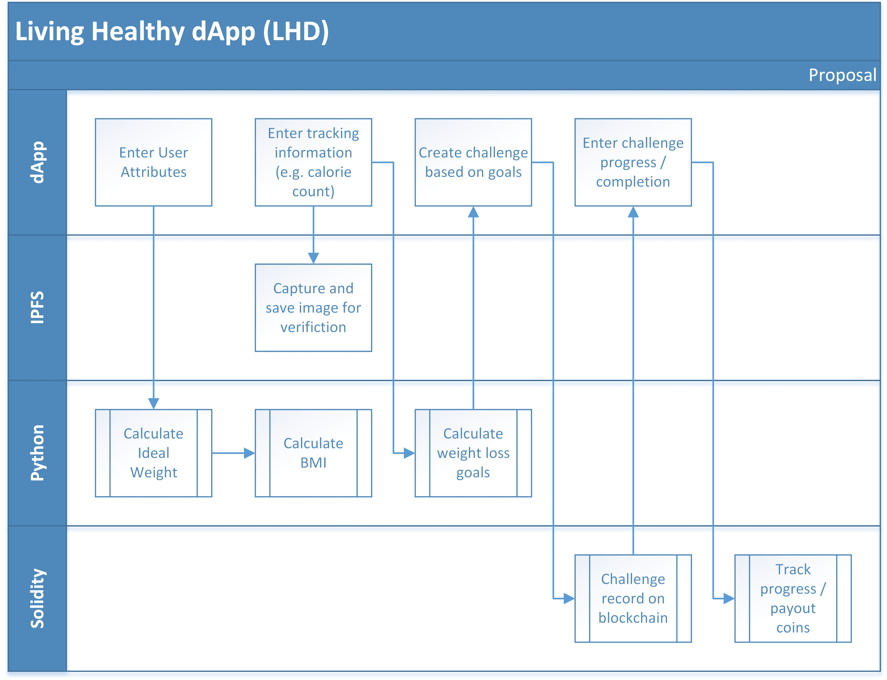

# Living Healthy dApp

## Members: 
* Aaron Packard
* John Millar
* Ricky Henderson

## Corporate Proposal

The new Living Healthy dApp (LHD) helps companies motivate employees to make healthier choices. LHD accomplishes this goal by motivating employees through money. We start with allowing companies to run their own ICO to create tokens Employees can earn for completing healthy tasks including: Exercise, Calorie Count, Weight Tracker and Challenges with Wagers. The corporation provides the initial investment to LHD to mint the Living Healthy Coins (LHC). The Solidity contracts provide the corporate address with the newly minted coins. Then employees are able to start competing for their share of the LHC. The employees can convert there LHC into real money, but corporation can control the exchange rate.

LHD allows companies to run solidity contract(s) to manage and retain the tokens they minted. Plus, the contracts are utilized of making public wagers for healthy competition. The LHD also provides employees the ability to calculate BMI, ideal weight, calorie in-take and calories burned Gender, Age and Activity level (Sedentary, Moderate or Active). The ideal weight, current weight and daily calorie goal are utilized to determine timeframe to reach ideal weight or timeframe to determine daily calorie goal. 

## Unique

> Compelling: Most company health programs are limited in the types of challenges and rewards are capped. LHD allows changes to be created on the fly through Solidity contracts and the coins available are unlimited.

> Transparent: Since we’re on a blockchain, the challenges are open for your friends to see and motivate you, your employer to track the benefit to the company and co-workers to challenge you.

> Flexible: Goals and challenges are controlled by the employee instead of pre-configured.

## Process

The beauty of this dApp process is the simplicity of standing up a new environment for a client. The Solidity contracts and online storage provides an application that is quick to implement and expandable for any size corporation.

### Set up

* Connect dApp to Python code, IPFS, and Solidity contracts
* Mint Coins through Solidity Contract
* Send coins to HR address that pays out the contracts
* Enroll employee addresses on dApp and Solidity contracts

### Process Flow

* dApp sends user attributes to Python
* Python calculates Ideal Weight and BMI for display on dApp

* dApp captures tracking information
* IPFS saves image for verification
* Python calculates weight loss goals and time to reach goals

* dApp captures challenges, wagers and completion
* Challenge recorded on blockchain
* Solidity Contract accepts wager
* Solidity distribute winnings at the end of the challenge

### Data stored

* User inputs (weight, age, gender)
* Activity inputs (MET, time, user data)
* Calorie inputs (break, lunch, snack, dinner)
* Challenge inputs (address of challenger, address of user, wager, goal, activity)
* outputs (winner and winnings)

## Programs

The programs and code utilized for this dApp are developed for basic developers to maintain and customize. The Python code does not utilize any libraries and the Solidity contracts are based off standard Solidity contracts. Therefore the maintenance costs are greatly reduced compared to normal health tracking applications.

### dApp

* Capture user data (height, weight, age, gender)
* Capture calorie information (calorie in-take, activities)
* Capture employee challenges and wagers
* Capture tasks completions

### IPFS

* Capture images to verify the completion of tasks and challenges

### Python

* Calculate BMI, Ideal Weight and time to reach Ideal Weight based on Calorie Burn and Calories In-take 

### Solidity

* Contract to Mint coins and transfer to corporate address managing the LHD
* Contracts to control the transfer of coins based on tasks, challenges and wagers
* Contract for employees to create challenges and set wager
* Contract for employees to cash out winnings from completed challengs

### AJAX

* Integration of dApp with IPFS and Python code

### Metamask

* Utilized for testing Solidity contracts (minting, challenges and transfers of winnings)

## Use Cases

There are three basic use cases: entering user data, entering calorie data and challenges

### Use Case 1 – User Data

* Employee starts with entering user inputs and address for payout
* System calculates BMI and ideal weight based on user date

### Use Case 2 – Calorie Tracking

* Employee enters activity inputs
* Employee enters calorie inputs
* Returns goal info (how'd you do)

### Use Case 3 - Challanges

* Employee starts challenge with address of challenger and activity (goal based on activity for now)
* Enters activity inputs
* Returns Total Calories for the challenge 
* Solidity contract pays out to address with highest activity reached (e.g. most calories burned in a day or biggest diff between burned and consumed)

### Use Case Assumptions:
* Member Already Signed In
